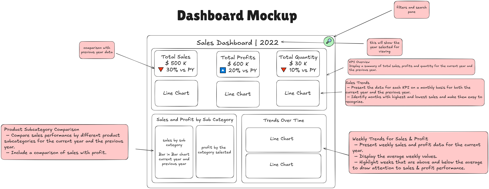

# Tableau Project - Analyzing Sales (Dashboard)

Source - https://www.datawithbaraa.com/tableau/tableau-sales-project-thank-you/

## Step 1 - Designing the Dashboard Mockup

Before jumping into Tableau, I sketched out a **dashboard wireframe** to ensure a logical flow of insights. The goal was to make data both **visually appealing and easy to interpret**.

<aside>
💡

### **Key Elements in My Mockup as per user stories:**

✔ **KPI Overview** – A quick summary of Total Sales, Total Profits, and Total Quantity, comparing them to the previous year.

✔ **Sales Trends** – Monthly trends for key metrics, highlighting high and low sales periods.

✔ **Product Subcategory Comparison** – A bar-in-bar chart showing sales performance across different subcategories, including profit margins.

✔ **Weekly Trends for Sales & Profit** – A breakdown of weekly sales trends with emphasis on above-average and below-average weeks.

✔ **Filters & Search Pane** – An interactive section to allow users to explore data dynamically.

This mockup helped me **visualize the layout** and ensured that each component had a clear purpose before bringing it into Tableau.

</aside>

## Step 2 - Deciding the color scheme

Once the layout was finalized, I shifted my focus to selecting the right **color scheme**—an essential step in making the dashboard intuitive and engaging.

<aside>
💡

### **Color Choices & Their Purpose:**

🎨 **Red/Orange for Total Sales & Quantity** – Since these KPIs can fluctuate significantly, these colors help signal changes clearly, especially declines.

🎨 **Green for Total Profits** – A positive indicator, reinforcing growth or improvement.

🎨 **Consistent Icons & Labels** – Up/down arrows for percentage changes to enhance clarity.

🎨 **Subtle Background & Borders** – Keeping it clean and distraction-free to maintain readability.

The aim was to **use colors strategically**, not just aesthetically, ensuring that trends and insights pop out without overwhelming the viewer.

</aside>

## Step 3 - Creating my Data Model

Now that I have my **dashboard mockup and color scheme** finalized, the next step is structuring my **data model** to ensure smooth integration and analysis in Tableau.

### **Data Profiling: Understanding My Tables**

I started by analyzing the available tables and categorizing them into **dimension tables** (descriptive data) and **fact tables** (measurable data).

<aside>
💡

📌 **Customer Table (Dimension Table)**

- Contains **Customer ID** and **Customer Name**.
- Used for **customer-based filtering and aggregation**.

📌 **Location Table (Dimension Table)**

- Includes **City, Country, Region, State, and Postal Code**.
- Helps with **geographical analysis and mapping** in Tableau.

📌 **Orders Table (Fact Table)**

- The **main transactional table** containing **Customer ID, Product ID (foreign keys), and various measures**.
- Used for **sales, profit, and quantity analysis**.

📌 **Product Table (Dimension Table)**

- Contains **product-specific attributes**.
- Useful for **category-based analysis.**
</aside>

## Step 4 - Building Chart and Dashboarding

Transforming business requirements into charts was no easy task—far from a one-and-done process! 🤪

I went through multiple iterations of the dashboard, refining it each time and uncovering hidden mistakes along the way. Below, you'll find an attached image where I’ve broken down and analyzed every aspect of my dasboard

This is the initial version after simply placing all the elements (charts) on the dashboard. I included it to highlight that dashboards don’t instantly look polished—just placing the charts is only the beginning!

This was my first dashboard design, created before I read "Storytelling with Data" by Cole Nussbaumer Knaflic (an absolutely amazing book!).

After gaining new insights, I revisited every aspect of my dashboard. You can check out my detailed review in the image below!

After making improvements, my dashboard just got an upgrade (Dashboard OS 2.0 🤪) —especially in terms of clarity and effectiveness!

Check out the dashboard on - http://public.tableau.com/app/profile/harshee.pitroda/viz/SalesDashboard_17399915783890/Dashboard1

Written By,

Harshee Pitroda